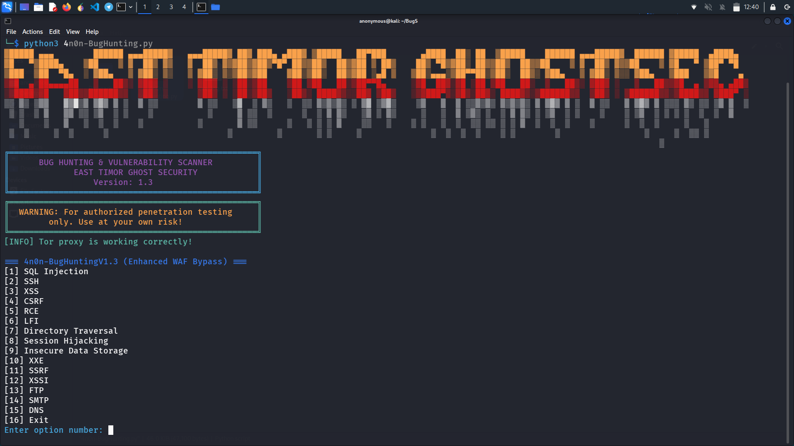

4n0n-BugHunting V1.3 🐞🛡️

   4n0n-BugHunting V1.3 is a comprehensive toolkit designed for penetration testing and vulnerability assessment. This project is tailored for cybersecurity professionals and offers an extensive suite of testing modules, including SQL Injection, SSH, XSS, CSRF, RCE, LFI, and more. Featuring advanced capabilities such as encrypted logging, anonymity via Tor, and stealth scanning techniques, this tool enables security teams to identify and mitigate potential risks efficiently and securely.

   
   
   
   
   
   
Install Dependencies

       pip3 install paramiko requests colorama jinja2 cryptography pysocks dnspython urllib3

📱 Termux (Android)

       pkg install update && pkg upgrade -y
       pkg install python -y
       pkg install git -y
       git clone https://github.com/EastTimorGhostSecurity/4n0n-BugHuntingV1.3.git
       cd 4n0n-BugHuntingV1.3
       python3 4n0n-BugHuntingV1.3.py

🪟 Windows

       pip install paramiko requests colorama jinja2 cryptography pysocks dnspython urllib3
       git clone https://github.com/EastTimorGhostSecurity/4n0n-BugHuntingV1.3.git
       python3 4n0n-BugHuntingV1.3.py

🍎 macOS

       brew install python
       pip3 install paramiko requests colorama jinja2 cryptography pysocks dnspython urllib3
       git clone https://github.com/EastTimorGhostSecurity/4n0n-BugHuntingV1.3.git
       cd 4n0n-BugHuntingV1.3
       python3 4n0n-BugHuntingV1.3.py

🐧 Linux

      sudo apt update
      sudo apt install python3 python3-pip
      pip3 install paramiko requests colorama jinja2 cryptography pysocks dnspython urllib3
      git clone https://github.com/EastTimorGhostSecurity/4n0n-BugHuntingV1.3.git
      cd git clone 4n0n-BugHuntingV1.3
      python3 4n0n-BugHuntingV1.3.py

Contributions & Contact 🤝

Contributions, suggestions, and bug reports are highly welcome! Please submit a pull request or open an issue if you encounter any problems. For further inquiries or more information about the team, feel free to reach out via Telegram:https://t.me/Easttimor_ghostsec
